# Spiking Neural Networks

## What they are and why they exist

In a standard neural network, a neuron computes $y = f(Wx + b)$, outputs a continuous value, and that's it. A spiking neuron is different: it has internal state that evolves over time, accumulates input into a membrane potential, and when that potential crosses a threshold, it fires a discrete spike and resets. The output isn't a number — it's a sequence of events in time.

This means an SNN is a dynamical system, not a static function. It has two kinds of structure: spatial (connectivity between neurons) and temporal (how internal states evolve). A conventional ANN computes each layer once per forward pass. An SNN computes evolving states across many timesteps.

The literature calls SNNs "third-generation" neural networks — after binary threshold units (first) and continuous-activation networks like sigmoids and ReLU (second). The label isn't that important. What matters is that time and discrete events become first-class parts of the computation.

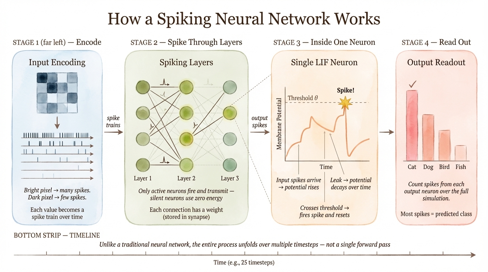

## Why anyone bothers

**Biology.** Real neurons spike. If you want to model actual neural computation, SNNs are a better abstraction than ReLU networks. But slapping spikes on a network doesn't make it biologically realistic — most modern SNNs are still trained with machine learning methods that have nothing to do with cortical learning.

**Time.** SNNs process time natively. In a feedforward ANN, you have to bolt on recurrence, attention, or windowing to handle temporal data. In an SNN, temporal dynamics are already in the neuron model.

**Sparsity.** A non-spiking neuron transmits a value every timestep — if you're simulating at 1 kHz, that's a thousand 16- or 32-bit numbers per second per neuron. A spiking neuron sends a binary pulse only when it fires, maybe 50 times per second. That's sparsification over time, not just over space, and it compounds across thousands of neurons. On the receiving end, the savings go further: when a spike arrives, you look up a weight and add it; when nothing arrives, you do nothing. No multiplications, just accumulates — and sums are cheaper than multiply-accumulates in hardware. Communication, not arithmetic, is what dominates energy consumption in neural network hardware, and spikes radically reduce communication. The catch: these savings are architectural, not algorithmic. They only materialize if your hardware is designed to exploit event-driven sparsity. Running a dense SNN simulation on a GPU is often slower than just running a conventional network.

**Neuromorphic hardware.** Chips like Intel Loihi, IBM TrueNorth, and SpiNNaker are designed for spike-based computation. On those platforms, SNNs can deliver real efficiency gains — but the gains are specific to the chip, the workload, and the sparsity level. They don't generalize to "SNNs are always efficient."

## Neuromorphic computing: the hardware problem behind SNNs

To understand why SNNs exist in the first place, you need to understand what's wrong with the way conventional computers work — and what the brain does differently.

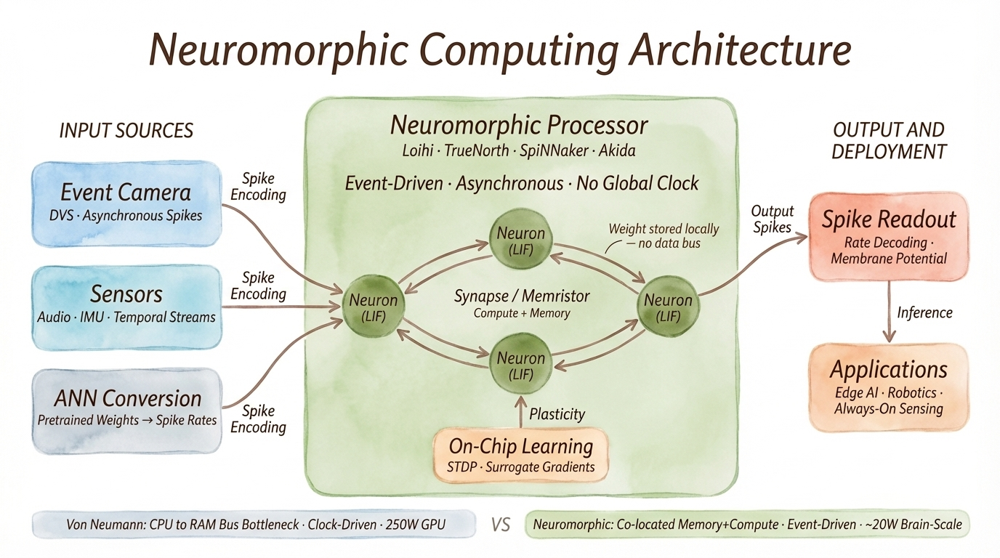

> *The "~20W brain-scale" figure at the bottom refers to the human brain's power consumption. Current neuromorphic chips like Loihi consume milliwatts to single-digit watts — they're far smaller than brain-scale. The comparison is aspirational: a full brain-scale neuromorphic system might match the brain's 20W, versus ~250W for a GPU doing equivalent work.*

> **Revision note:** This diagram could be improved by adding the reverse path — SNNs can be simulated on von Neumann hardware (GPU/CPU), but lose the efficiency advantage since the architectural gains (event-driven sparsity, co-located memory) don't apply. The current diagram shows ANN→SNN conversion as an input but not the VN↔NM hardware relationship explicitly.

### The von Neumann bottleneck

Every conventional computer — your laptop, your GPU cluster, your phone — follows roughly the same architecture that John von Neumann described in the 1940s. There's a processing unit (CPU/GPU) and there's memory (RAM), and they're physically separate. Every computation requires shuttling data back and forth between the two.

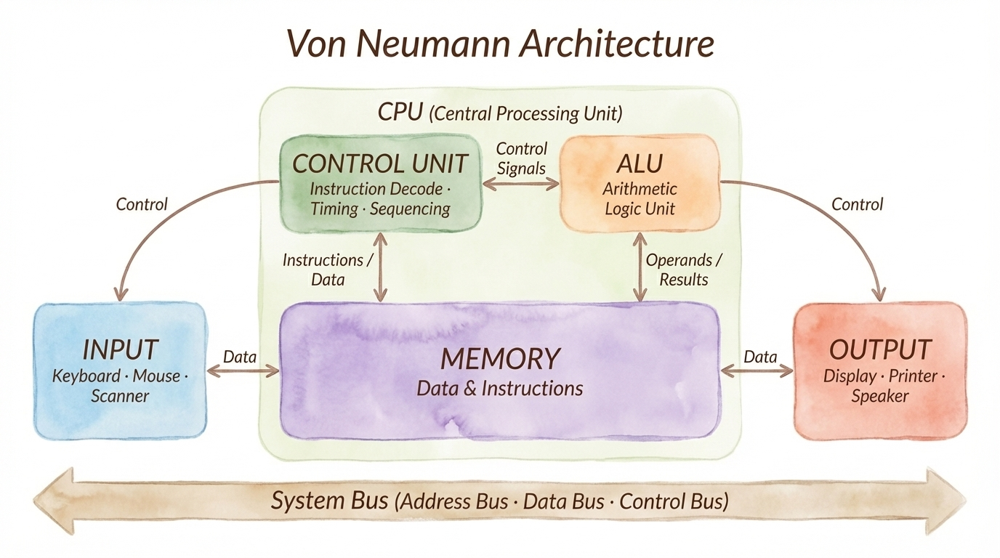

This bus between processor and memory is the **von Neumann bottleneck**. It limits bandwidth (how much data can move per second), adds latency (every operation waits for data to arrive), and burns energy (moving data across a chip costs far more energy than the actual computation). Modern CPUs spend most of their power budget just moving data around, not computing.

This matters for neural networks specifically because: every weight lookup, every activation, every gradient update requires round-trips between processing and memory. When you're training a model with billions of parameters, you're bottlenecked by memory bandwidth, not arithmetic.

### How the brain is different

Your brain runs on roughly 20 watts — a banana and a cup of coffee. It can recognize faces, navigate complex environments, and learn new motor skills in ways that still take massive GPU clusters hours to approximate. The reason isn't that neurons are faster than transistors (they're millions of times slower). It's the architecture.

In a biological brain, there is no separation between memory and processing. Each synapse — the connection between two neurons — is both a computing element and a memory element simultaneously. A synapse processes signals *and* stores its own connection strength. There's no bus. There's no data transfer bottleneck. Everything is local.

The key differences:

| | Von Neumann | Brain / Neuromorphic |
|---|---|---|
| Memory and processing | Physically separated | Co-located in every synapse |
| Communication | Data bus (continuous transfer) | Spikes (event-driven, sparse) |
| Energy cost | Dominated by data movement | Dominated by actual computation |
| Processing style | Sequential clock cycles | Massively parallel, asynchronous |
| Power | ~250W (GPU) | ~20W (human brain) |

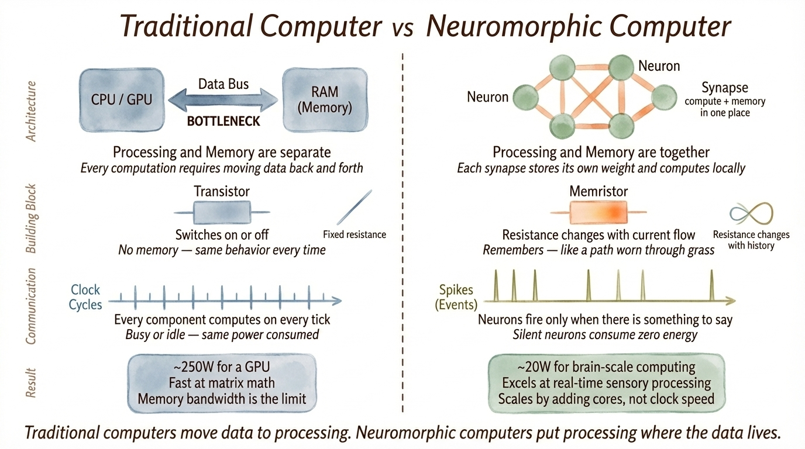

### The neuromorphic idea: co-locate memory and processing

Neuromorphic computing is the attempt to build this brain-like architecture in silicon. The central principle is simple: **put the memory and the processing in the same physical location**, eliminating the data transfer bottleneck entirely.

This requires a fundamentally different kind of electronic component. A standard resistor has no memory — apply voltage, current flows according to Ohm's law ($V = IR$), and when you remove the voltage, the resistor has no record of what happened. But a synapse *does* remember. It strengthens or weakens based on past activity. That's how learning works.

### Memristors: artificial synapses

The device that makes this concrete is the **memristor** (memory + resistor). A memristor is a resistor whose resistance changes based on the history of current that has flowed through it. Apply voltage one way and its resistance decreases; apply it the other way and it increases. Remove the voltage entirely, and it *remembers* its last resistance state.

Think of it as a tiny variable resistor that programs itself. In the HP Labs device that kicked off the modern wave (Strukov et al., 2008), this worked by using an electric field to physically move dopant ions through a thin film of titanium dioxide. Moving the ions changed the material's conductivity, and they stayed put when the field was removed — giving the device persistent memory.

Electrically, a standard resistor traces the same straight line on a current-voltage plot no matter how many times you cycle it. A memristor traces a **hysteresis loop** — the current you get going up is different from the current going down, because the device itself has changed. That hysteresis *is* the memory.

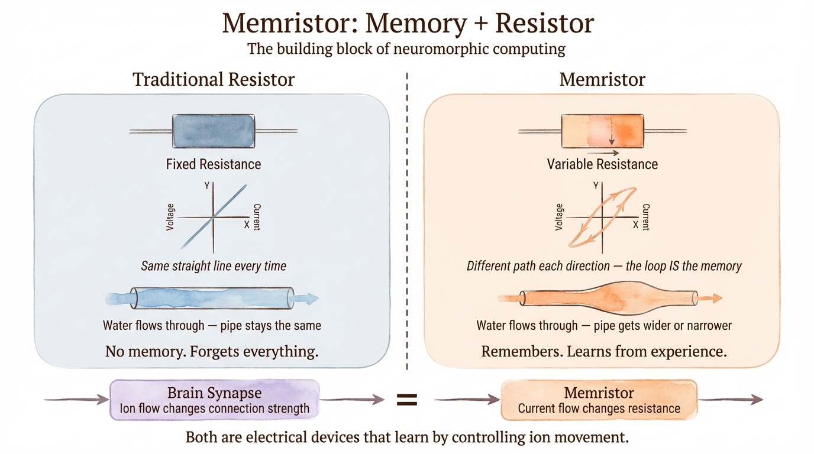

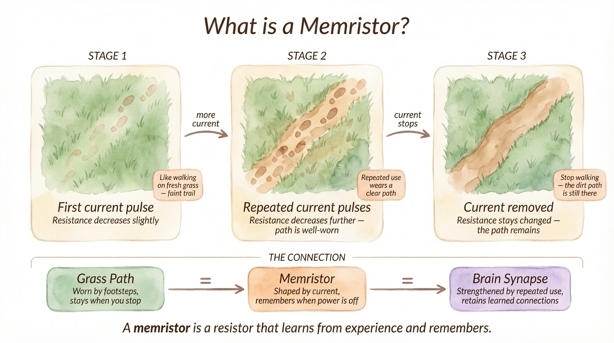

This is directly analogous to what biological synapses do. In the brain, ion flow through synaptic channels changes the connection strength between neurons. In a memristor, ion flow through a solid-state material changes the device's resistance. Both are electrical devices that learn by controlling ion movement — one in liquid (neurotransmitters in the synaptic cleft), the other in a solid-state film.

The biological analogy goes further. Brief current pulses create temporary resistance changes in a memristor — analogous to **short-term plasticity** in the brain. Sustained or repeated pulses can cause permanent structural changes (ions bonding across the device) — analogous to **long-term potentiation**, the mechanism behind lasting memory formation. It's the same principle as burning neural pathways through repetitive practice: at first the connections are fragile, but with enough repetition, they become permanent.

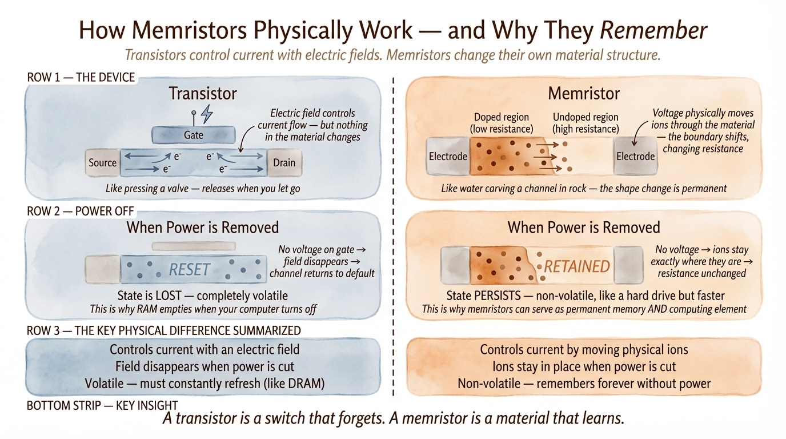

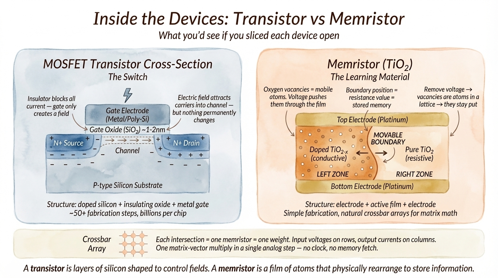

When memristors are arranged in a crossbar array — one device at every row-column intersection — the entire structure performs a matrix-vector multiplication in a single analog step. Input voltages applied to row lines produce output currents on column lines, with each memristor's conductance acting as a weight. This maps directly onto the dominant operation in neural networks and eliminates the need for a separate memory fetch: the weight *is* the device.

### Where SNNs fit in

Here's where the pieces connect:

**Neuromorphic hardware** (Loihi, TrueNorth, memristor-based chips) provides the physical substrate — processors where memory and computation are co-located, communication is event-driven, and energy scales with activity rather than clock speed.

**Spiking neural networks** are the computational model that runs natively on this substrate. SNNs communicate through discrete spikes, just like the voltage pulses that program memristors and the action potentials that trigger neurotransmitter release in biological synapses. The spike-driven, event-based nature of SNNs maps directly onto hardware where computation only happens when an event arrives — no clock cycle wasted on silent neurons.

This is why "SNNs are more efficient" is a conditional statement. An SNN running on neuromorphic hardware with sparse, event-driven input can be radically more efficient than a GPU-based ANN — because the hardware eliminates the memory bottleneck and only spends energy on active neurons. The same SNN simulated on a conventional GPU gets none of those architectural advantages. The efficiency comes from the combination of the computational model (spikes) and the hardware (co-located memory+compute), not from either one alone.

### Inside a neuromorphic processor

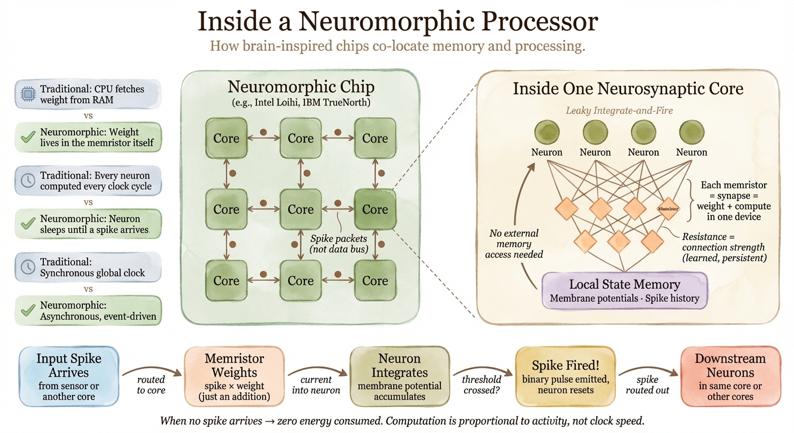

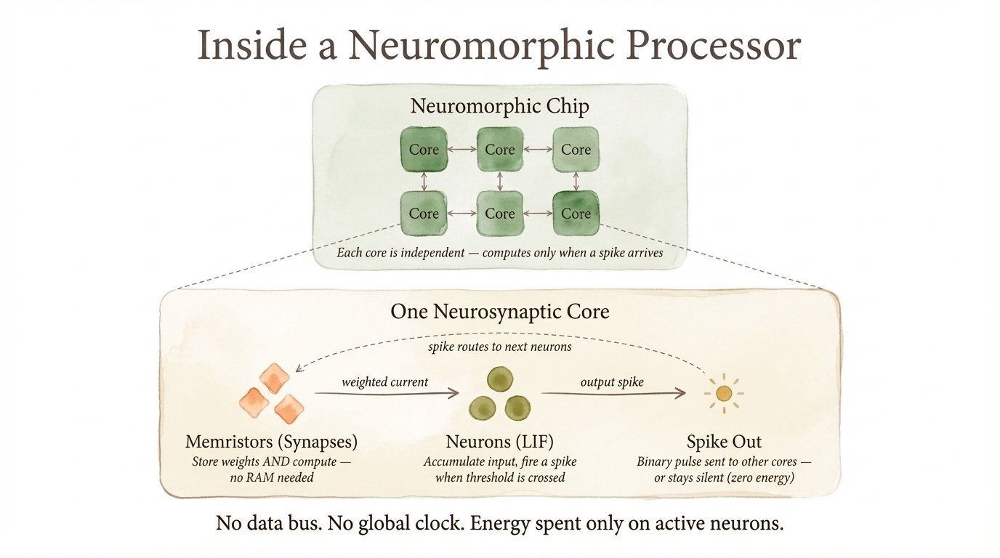

### The hardware trajectory

If you look at AI hardware chronologically, each generation has moved closer to how brains compute. CPUs (commercially dominant from the 1970s) are fast serial processors — minimal parallelism, no architectural awareness of neural computation. GPUs (repurposed for ML around 1999) added massive parallelism, which happened to suit matrix multiplication. TPUs (Google, 2016) were purpose-built for dense neural network operations — more parallel, more specialized, but still fundamentally about continuous-valued matrix math on a global clock. Neuromorphic processors (Intel Loihi research chip, ~2021 for broader access) take the final step: spiking, asynchronous, event-driven, with co-located memory and compute.

Each step increased parallelism and decreased energy per inference. But the neuromorphic step also changes the communication model. Conventional chips synchronize everything to a global clock — every core does work on every cycle whether there's input or not, and synchronizing thousands of cores is itself expensive. Neuromorphic chips use asynchronous, event-driven communication: a core sits idle until a spike arrives, processes it, and goes back to sleep. No global clock, no wasted cycles on silence. Scaling happens by tiling more cores rather than increasing clock speed, which is why power consumption grows slowly as networks get larger — a property that matters enormously for deploying large models.

## The spiking neuron

### Leaky integrate-and-fire (LIF)

This is the workhorse neuron model in ML-oriented SNN work. It does three things: accumulate input, leak toward a resting potential, and fire when threshold is crossed.

The continuous-time equation:

$$
\tau_m \frac{dV(t)}{dt} = -(V(t) - V_{\text{rest}}) + R\, I(t)
$$

$V(t)$ is membrane potential, $\tau_m$ is a time constant controlling how fast the neuron forgets, $I(t)$ is input current. When $V(t)$ exceeds threshold $\theta$, the neuron emits a spike and resets.

In the discrete-time form used in PyTorch-based frameworks, this becomes a recurrence:

$$
V_t = \beta\, V_{t-1} + W x_t - S_{t-1}\, \theta
$$

$\beta \in (0,1)$ controls leak (how fast state decays), $x_t$ is input at timestep $t$, $S_{t-1}$ is a binary spike indicator, and the $-S_{t-1}\theta$ term handles reset after firing. This is simple enough to implement as a PyTorch module with autograd support.

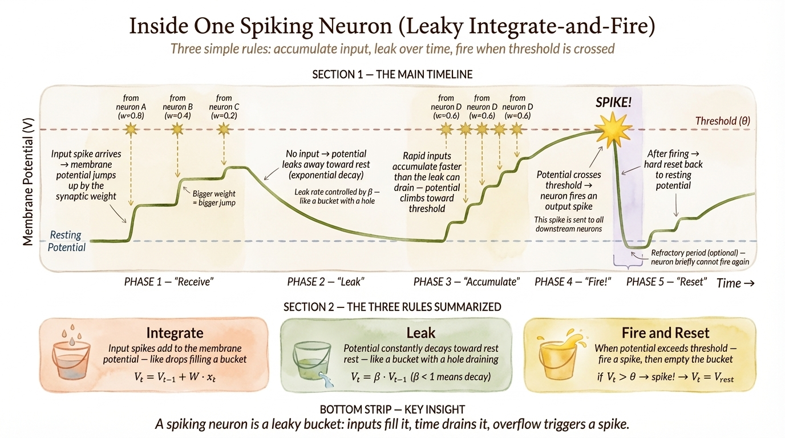

After spiking, the neuron may hard-reset to rest or soft-reset by subtracting $\theta$. Some models add a **refractory period** — a brief window after spiking where the neuron can't fire again. These details affect firing rate, sparsity, and gradient flow during training.

### Other neuron models

**Izhikevich.** Two coupled equations that can reproduce ~20 different biological firing patterns (bursting, chattering, fast-spiking, etc.) at modest computational cost. Useful when you want richer dynamics than LIF but don't want to go full biophysical. Less common in deep SNN training pipelines because the tooling hasn't standardized around it, but dominant in large-scale biological modeling — a full-scale model of the mouse hippocampal CA3 region (80,000 neurons, 250 million synapses, 8 morpho-chemically identified cell types) used Izhikevich neurons precisely because they can reproduce the full diversity of hippocampal firing patterns (adaptive spiking, regular spiking, bursting, stuttering) through simple parameter tuning, while remaining computationally efficient enough to simulate on GPUs via CARLsim.

**AdEx (Adaptive Exponential Integrate-and-Fire).** Adds an exponential term for spike initiation and an adaptation variable. Popular in computational neuroscience as a middle ground between toy models and biophysics. More parameters to tune than most ML practitioners want.

**Hodgkin-Huxley.** The original biophysical model: ion channels, conductances, gating variables. Scientifically important, computationally expensive, and irrelevant for your first ML-oriented SNN.

Start with LIF. Move to something else only when LIF provably can't do what you need.

### Synapses

In simple ML setups, an incoming spike becomes a weighted addition to the downstream neuron's membrane potential — same as a weight times an input. In more detailed models, synaptic currents have their own dynamics: exponential rise, exponential decay, or alpha-function shapes. This gives the network additional temporal memory beyond what's in the neuron state. The time constants of synapses and neurons together determine what temporal scales the network is sensitive to.

Biologically detailed models go further with **short-term synaptic plasticity** (STP) — the Tsodyks-Markram formalism, where synaptic strength changes dynamically depending on recent presynaptic activity. A synapse can facilitate (get temporarily stronger with rapid firing) or depress (get temporarily weaker). STP is distinct from long-term learning rules like STDP; it's a fast, reversible mechanism that shapes network dynamics on the timescale of tens to hundreds of milliseconds. In the CA3 hippocampus model mentioned above, STP fitted from experimental data was essential for reproducing realistic circuit dynamics — the network maintained stable chaotic activity without saturating or dying, a property that depends critically on having the right short-term synaptic properties for each of 51 distinct connection types.

## Spike coding: where does information live?

With continuous activations gone, information has to be encoded in the timing and pattern of spikes. There are several schemes, and the choice matters more than beginners expect.

**Rate coding.** Count spikes over a time window. Stronger stimulus → higher firing rate. This is the simplest scheme, the easiest to train, and what ANN-to-SNN conversion implicitly assumes. The downside: you need enough timesteps for rates to be meaningful, and you're throwing away fine timing information.

**Temporal / latency coding.** Information is in *when* a spike occurs. Stronger stimulus → earlier spike. Potentially very fast (one spike can carry information) but harder to train and more sensitive to noise.

**Population coding.** Information is distributed across a group of neurons rather than encoded in any single one. This is how SNN outputs usually work in practice: you read out a class prediction from spike counts or membrane potentials across an output population.

**Burst coding** (information in short spike groups) and **phase coding** (timing relative to an oscillation) matter in neuroscience but are not where you start for ML work.

For a first project: use rate coding or Poisson encoding for static data, and use native event streams if your data comes from an event sensor.

## Encoding non-spike inputs

If your data isn't already spikes (and it usually isn't), you need to convert it.

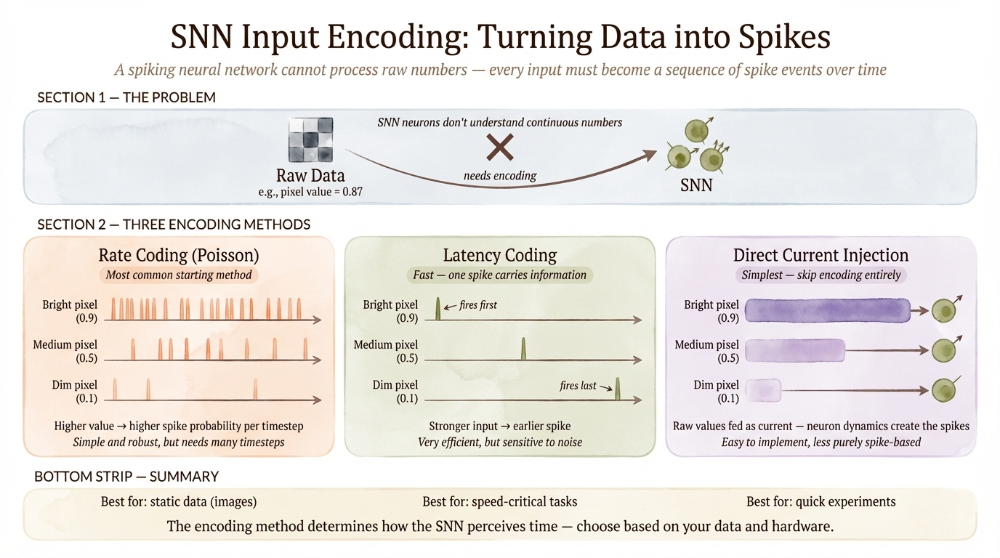

**Poisson encoding** maps each input value to a spike probability per timestep. A bright pixel generates frequent spikes, a dim one generates few. Simple and widely used. Adds stochastic noise and may need many timesteps.

**Latency encoding** maps each input value to a single spike time. Stronger input → earlier spike. Compact but finicky to tune.

**Direct current injection** skips the encoding entirely and feeds continuous values into neuron dynamics. Simpler for experimentation, less "purely spiking."

**Delta encoding** generates events only when the input changes. Natural for streaming data.

Start with whatever your framework tutorial uses. Poisson encoding is the most common default for static datasets.

## Network architecture

SNN architectures look familiar: fully-connected layers, convolutional layers, recurrent connections, pooling. The difference is that each layer's "activation function" is replaced by spiking neuron dynamics running across timesteps.

Feedforward SNNs are the simplest — input spikes flow through layers, output is read from the last layer. Convolutional SNNs inherit good spatial inductive biases from CNNs and are common in vision tasks. Recurrent SNNs are natural for temporal processing but harder to train because gradients must flow through time and through layers simultaneously.

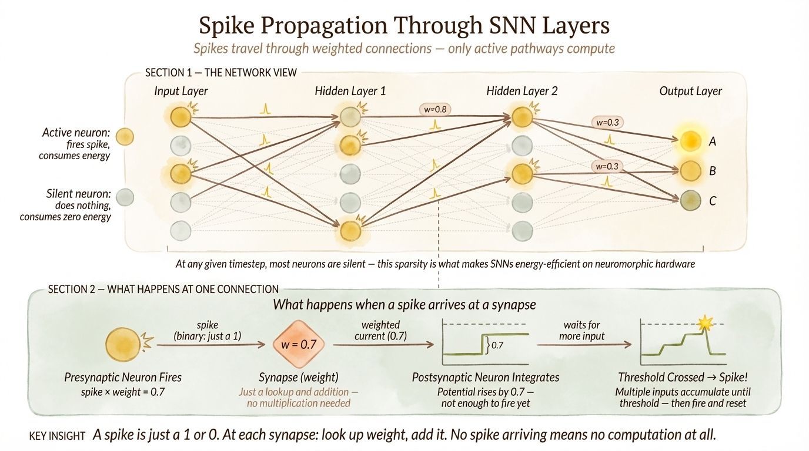

> *The diagram states "just a lookup and addition — no multiplication needed." This is slightly simplified. The operation is spike × weight, which is technically a multiplication — but since spikes are binary (0 or 1), it reduces to "add the weight or add nothing." A conditional addition rather than a floating-point multiply-accumulate. The distinction matters for hardware design: accumulates are far cheaper than multiply-accumulates.*

For output, you need a readout that collapses temporal activity into a prediction: spike count over the simulation window, final membrane potential, or a non-spiking integrator neuron. Spike counts are the most common and easiest to understand.

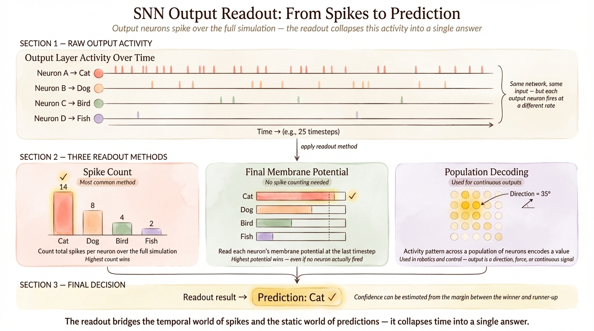

## Training

This is where SNNs get hard, and where most of the confusion lives. There are three fundamentally different approaches.

### STDP (spike-timing-dependent plasticity)

A local learning rule inspired by biology. If a presynaptic neuron fires just before a postsynaptic neuron, strengthen the synapse; if the order is reversed, weaken it:

$$
\Delta w =
\begin{cases}
A^+ e^{-\Delta t / \tau^+} & \text{if pre fires before post} \\
-A^- e^{\Delta t / \tau^-} & \text{if post fires before pre}
\end{cases}
$$

STDP is local (no global error signal needed), biologically grounded, and conceptually elegant. It works for unsupervised feature learning — Diehl & Cook (2015) trained a digit recognizer on MNIST using pure STDP. Masquelier & Thorpe (2007) showed STDP could learn visual features.

STDP also plays a central role in **cell assembly formation** — the Hebbian process where groups of neurons that fire together wire together into stable memory traces. This is the spiking-network realization of the Hopfield net idea. In a biologically realistic CA3 hippocampus model (Kopsick et al.), symmetric excitatory-excitatory STDP between pyramidal cells, trained in theta-locked sessions (~4 Hz), formed assemblies of 300 neurons that could be recalled from as little as 20% of the original pattern (60 out of 300 cells), with the remaining 80% reconstructing within half a theta cycle. Pattern completion accuracy ranged from 72–96% depending on degradation and training repetitions, across up to 250 independent assemblies in a single network — the storage capacity of a mouse-scale CA3. This is the kind of computation STDP was designed for: associative memory formation and retrieval without any gradient signal.

The problem: STDP doesn't scale well to deep supervised learning. It's hard to direct toward a specific task objective without adding reward modulation or other supervision signals, and it consistently underperforms gradient-based methods on standard benchmarks. Use it when biological plausibility, unsupervised learning, or associative memory is the point, not when you want the best accuracy on a classification task.

### Surrogate gradient training

This is the practical default for training SNNs from scratch.

The fundamental problem is that the spike function is essentially a Heaviside step: $S = H(V - \theta)$. Its derivative is zero everywhere except at threshold, where it's undefined. You can't backpropagate through that.

The surrogate gradient trick: use the real spike function on the forward pass, but substitute a smooth approximation (sigmoid, fast sigmoid, arctangent) for the backward pass. The network spikes normally during inference; during training, gradients flow through the smooth surrogate as if the spike function were differentiable.

This works. Zenke & Ganguli's SuperSpike (2018) laid important theoretical groundwork showing this isn't just an unprincipled hack — it's connected to tractable optimization in multilayer spiking networks. Lee, Delbruck & Pfeiffer (2016) demonstrated that deep SNNs could be trained directly with backpropagation variants on MNIST and N-MNIST, closing the gap between theory and practice. Eshraghian et al. (2023) wrote the best modern practical tutorial on the whole approach.

Since SNNs have temporal state, training typically uses **backpropagation through time (BPTT)**: unroll the network across timesteps, compute loss from output activity, backpropagate through the full temporal graph. This works because the SNN is just a recurrent dynamical system. The cost: memory scales with the number of timesteps, and gradients can vanish or explode over long horizons — same problems as training RNNs, with the additional complication of discrete spikes.

In practice: use surrogate gradients, Adam optimizer, a moderate number of timesteps, and a feedforward or convolutional architecture. This is what snnTorch and Norse are built around.

### ANN-to-SNN conversion

Train a conventional ANN with ReLU activations, then convert it to spiking neurons by interpreting each neuron's continuous activation as a firing rate. The spiking network needs enough timesteps to approximate the original continuous output through spike counts.

Diehl et al. (2015) showed that careful weight and threshold balancing can make converted SNNs match ANN accuracy closely. Hunsberger & Eliasmith (2015) demonstrated this with LIF neurons specifically.

Conversion is attractive when you already have a working ANN pipeline and want to deploy on neuromorphic hardware. It's also the easiest path to a high-accuracy SNN because ANN training is a solved problem. The cost: the converted network may require many timesteps for accurate rate approximation, and it doesn't learn any temporal dynamics that weren't in the original ANN. It's "rate-coded deployment," not temporal spike learning.

### Which approach to pick

| Goal | Method |
|------|--------|
| Biological plausibility, unsupervised learning | STDP |
| Train an SNN from scratch for a real task | Surrogate gradients |
| Deploy a pretrained ANN as a spiking network | Conversion |

Most people reading this guide should start with surrogate gradients.

## Temporal processing: the Legendre Memory Unit

LSTMs are the standard tool for sequence processing in conventional deep learning, but they don't have a clean spiking implementation. Their gating mechanisms rely on continuous-valued multiplications at every timestep — exactly the kind of operation that neuromorphic hardware is designed to avoid. If you want spike-efficient temporal processing at the level of LSTMs or better, you need a different architecture.

The Legendre Memory Unit (LMU), developed by Voelker and Eliasmith (2019), is a recurrent cell derived from first principles rather than trial and error. The design question was simple: if you want to optimally store a window of incoming signal over time, what dynamical system should you use? This is a well-posed mathematical problem. The input-output relationship for a pure delay — $y(t) = u(t - \theta)$ — transforms into a transfer function $F(s) = e^{-\theta s}$ in the Laplace domain, which is irrational and therefore infinite-dimensional. But optimal finite-dimensional rational approximations of irrational functions were solved in the 1960s via Padé approximants. Applying Padé to the delay transfer function and converting back to a linear time-invariant state-space form gives you the LMU's recurrence matrices directly — no hyperparameter search, no architecture guesswork.

The resulting system maintains a $q$-dimensional state vector whose components are coefficients of Legendre polynomials. These polynomials form an orthogonal basis for reconstructing the input signal over a sliding window of length $\theta$. The recurrence weights (from state to state, and from input to state) are fixed by the math — you don't learn them. Every experiment that tried learning them found no improvement. You pair this memory cell with a standard nonlinear hidden layer that learns to read useful features from the stored representation, and that hidden layer's weights are trained with normal gradient descent.

On the permuted sequential MNIST benchmark (psMNIST) — the standard stress test for recurrent architectures, where one pixel at a time from a scrambled digit is shown to the network — the LMU achieved 97.15% test accuracy versus 89.86% for a standard LSTM. It did this with 102,000 parameters versus 165,000, and with a 468-dimensional state (212 hidden + 256 memory) versus the thousands of hidden units typical of competitive RNN entries. On pure delay tasks, where the LMU is doing exactly what it was mathematically optimized for, it outperforms LSTMs by five orders of magnitude in mean squared error while handling 100x longer delays with 100x fewer parameters.

The property that matters for neuromorphic deployment: the LMU is robust to spiking. Implementing it with spiking neurons — both in software simulation and on physical neuromorphic chips (Intel Loihi, Stanford's Braindrop) — preserves performance. The fixed recurrence structure maps cleanly onto spike-based computation because it's a linear dynamical system: no gating multiplications, no sigmoid activations holding continuous state. This makes it a drop-in replacement for LSTMs in any pipeline that needs to run on neuromorphic hardware.

An unexpected validation came from neuroscience. "Time cells" — neurons observed in the hippocampus and prefrontal cortex that fire at specific delays after a stimulus — produce response patterns that closely match the LMU's internal spiking activity. The LMU predicts these distributions from first principles with a single parameter fit. This doesn't prove the brain is computing Legendre polynomials, but it suggests that whatever the brain does for temporal memory may be solving the same optimization problem.

## Where SNNs actually work well

SNNs are oversold in some contexts. Here's an honest assessment.

**Event-based vision** is the strongest use case. Event cameras (like those from iniVation/Prophesee) output asynchronous brightness-change events rather than frames. This data is natively spike-like, sparse, and rich in timing information. SNNs are a natural fit. Key datasets: N-MNIST, DVS Gesture, CIFAR10-DVS. Caveat: some neuromorphic benchmarks are small, synthetic, or converted from static images — don't overgeneralize results on them.

**Low-power edge inference** is where neuromorphic hardware makes the efficiency argument concrete. Always-on sensing, wearable devices, embedded anomaly detection — workloads where power budget matters more than raw throughput. This requires actual neuromorphic hardware to realize the gains, not just a GPU simulation.

**Robotics and control** benefit from SNNs' ability to process streaming input and produce fast event-driven responses. The strongest demonstration is adaptive robot control: a spiking network running on Loihi controlled a compliant robot arm, learned to compensate for unknown loads and changing joint dynamics (simulating years of wear), and did so 25–35% faster than CPU/GPU implementations with 10–50x less power — while matching accuracy. The key detail: this required on-chip learning (the controller adapts in real time), which dedicated edge-inference chips like the Movidius can't do at all — they're inference-only. Neuromorphic chips that support on-chip plasticity open a category of applications — continuously adapting controllers, self-calibrating sensors — that non-spiking edge hardware simply cannot address.

**Time-series and streaming signals** — sensor streams, audio-like data, anomaly detection — are reasonable SNN territory, though whether they outperform standard sequence models (LSTMs, transformers) depends on the specific setting.

**Computational neuroscience and brain modeling** is where SNNs are not competing with ANNs but rather are the only appropriate tool. If the goal is to understand how biological circuits compute — not to classify images — then biologically realistic SNNs are the model, not an optimization target. A full-scale model of the mouse hippocampal CA3 (80,000 Izhikevich neurons, 250M synapses, 386 experimentally derived parameters from hippocampome.org) demonstrated pattern completion via cell assemblies: training with theta-locked STDP, retrieval from partial cues, and emergent firing patterns matching in vivo recordings. This was run on GPUs using CARLsim, with a neuromorphic hardware implementation as a parallel research track. The simulation ran at roughly 1:10 real-time (1 second of biological time takes ~10 seconds to compute), which is fast enough to run many parameter sweeps per hour but not real-time. Models like this are where the neuroscience of memory, the biophysics of synapses, and the engineering of large-scale SNN simulation converge — and they produce testable predictions about how specific inhibitory cell types (basket cells, axo-axonic cells, OLM cells, ivy cells) shape memory formation and retrieval.

**Static image classification on GPU** is where SNNs are weakest. You have to encode images into spikes, simulate across timesteps, and deal with more complex training — all for results that rarely beat a standard CNN. Don't reach for an SNN here unless you have a specific reason (neuromorphic deployment, power constraints, event sensors).

## Neuromorphic hardware

**IBM TrueNorth** (Merolla et al., 2014): historically important, demonstrated large-scale low-power spike hardware with a million neurons. More of a proof point than a current development platform.

**Intel Loihi / Loihi 2**: the most active neuromorphic research platform right now. Supports on-chip learning, asynchronous spike processing, and has an associated software stack (Lava). Relevant if you're targeting actual neuromorphic deployment.

**SpiNNaker** (Furber et al., 2013): massively parallel, designed for large-scale neuroscience simulation. More academic/neuroscience-focused than ML-focused.

**BrainChip Akida**: commercial neuromorphic chip aimed at edge AI. Less prominent in the research literature but relevant for commercial deployment.

The critical thing to understand: when a paper claims "10x energy efficiency," that claim is about a specific model, on a specific chip, with a specific sparsity level, on a specific workload. It is not a general property of SNNs. An SNN on a GPU can easily be *less* efficient than a well-optimized ANN on the same GPU.

That said, the measured numbers on appropriate workloads are striking. On a keyword-spotting task (a real-time speech application — exactly the kind of dynamic processing neuromorphic chips target), a spiking network on Intel Loihi used 109x less energy per inference than an NVIDIA GPU, 23x less than an Intel CPU, and 5x less than dedicated edge-inference hardware (Intel Movidius NCS2) — all running the same network architecture with matched accuracy (SNN 93.8% vs ANN 92.7%). These are measured end-to-end numbers, not theoretical TOPS/watt estimates. The distinction matters: TOPS/watt figures (trillion operations per second per watt) are computed from single-operation energy costs and extrapolated to expected workloads. Nobody who has gotten a TOPS/watt number and then run an actual application on the hardware has achieved it. Real system measurements account for data movement, pipeline overhead, and all the things that theoretical estimates miss.

The scaling behavior is equally important. When the keyword-spotting network was scaled 50x in size, Loihi's power consumption increased by roughly 20%. The best non-spiking edge hardware (Intel Movidius) increased by roughly 500% for the same scaling. Neuromorphic hardware scales by tiling additional cores, each independently efficient; conventional hardware hits memory bandwidth and synchronization walls as networks grow. This is a research chip without the standard power-optimization techniques applied to the commercial hardware it was compared against, so the gap should only widen.

Think of spiking as another dial in your optimization. It lets you trade between power efficiency and accuracy. In many cases you get the same accuracy with dramatically less power — a free win. In some cases you lose a fraction of a percent in accuracy and save 10x in energy, and whether that trade is worth it depends entirely on the application. It is not a guaranteed improvement for every workload, but it is a real and measurable one for the workloads that suit it.

## Frameworks

**snnTorch** is the best starting point. It's built on PyTorch, treats spiking neurons as standard `nn.Module` layers with surrogate gradient support, and has an unusually good tutorial series. If you know PyTorch, you can be running a trainable SNN in an afternoon.

**Norse** is also PyTorch-native and more modular. It supports LIF, LSNN (adaptive spiking neurons as in Bellec et al. 2018), and has examples for MNIST, CIFAR, and control tasks. Slightly less hand-holding than snnTorch for absolute beginners, but a strong choice once you understand the basics.

**SpikingJelly** has a large and active ecosystem for deep-learning-oriented SNN research, with good support for both single-step and multi-step simulation modes.

**Brian2** is a neuroscience simulator, not an ML framework. You write equations and it simulates them. Excellent when model equations are the point, not the right tool for training a classifier.

**BindsNET** is focused on biologically inspired learning (STDP-family rules) with PyTorch. Good for that specific niche.

**Lava** is Intel's framework for Loihi. Use it if you're targeting Loihi hardware specifically.

**NEST** is for large-scale neuroscience simulation. Not for ML beginners.

**CARLsim** is a GPU-accelerated SNN simulator optimized for biologically realistic networks with Izhikevich neurons, short-term plasticity (Tsodyks-Markram), STDP, and compartmental neuron models. It was used for the full-scale mouse CA3 hippocampus model (80,000 neurons, 250M synapses). The right tool when your model is defined by biological parameters — connection probabilities, synaptic physiology, cell-type-specific wiring — rather than by a machine learning loss function.

**Nengo / NengoDL** implements the Neural Engineering Framework and is the most mature tool for building large-scale spiking networks that compile to multiple backends — the same model can target conventional hardware (CPU/GPU), Intel Loihi, FPGAs, or analog neuromorphic chips without rewriting code. It was designed with temporal dynamics and spiking from day one. The Spaun model — 6.6 million spiking neurons, billions of connections, the world's largest functional brain model — was built in Nengo and remains the largest recurrent neural network by neuron count. The framework is free for research. Less beginner-friendly than snnTorch for a first MNIST project, but the right choice when you need cross-platform neuromorphic deployment or are working at a scale where backend portability matters.

## Getting started: four projects in order of difficulty

### 1. Static classification with spikes

Take MNIST or Fashion-MNIST. Poisson-encode the images. Build a small feedforward or convolutional SNN with LIF neurons in snnTorch. Train with surrogate gradients and Adam. Read out class predictions from output spike counts. This teaches you the basic loop: encoding → spiking dynamics → readout → loss → surrogate backward pass. Pay attention to how accuracy changes with the number of timesteps — this is the first thing that distinguishes SNN training from ANN training.

### 2. Event-based data

Use N-MNIST or DVS Gesture with a tutorial-backed pipeline. Keep preprocessing simple — don't convert events back to frames. Train a small convolutional SNN. Compare against a baseline that *does* use framed data. Track time-to-decision, not just final accuracy. This is where SNNs start to make sense on their own terms.

### 3. ANN-to-SNN conversion

Train a standard CNN on MNIST/CIFAR. Convert to spiking neurons. Calibrate thresholds. Measure accuracy as a function of inference timesteps. This teaches you the rate-coding interpretation and the tension between accuracy and latency in converted networks.

### 4. Temporal task

Pick a small sensor sequence or time-series classification problem. Use a feedforward-over-time or small recurrent SNN. Compare against a small LSTM or GRU baseline. This pushes you past the misconception that SNNs are just image classifiers that happen to be slower.

## Common failure modes

**Dead neurons.** Thresholds too high or weights too small → neurons never spike → zero gradients → nothing trains. Monitor firing rates. Lower thresholds, fix initialization, add activity regularization.

**Runaway firing.** Thresholds too low → everything spikes all the time → no sparsity, unstable training. Raise thresholds or add regularization.

**Wrong number of timesteps.** Too few: not enough spikes for meaningful rates. Too many: expensive, slow, vanishing gradients. Start with your framework's tutorial default and sweep from there.

**No ANN baseline.** If you don't know what a conventional network achieves on your task, you can't tell whether the SNN's added complexity is buying you anything.

**Confusing rate coding with temporal intelligence.** Many trained SNNs are effectively counting spikes over a window — which is rate coding. That's fine, but it's not the same as exploiting precise spike timing. Know which your model is actually doing.

**Overgeneralizing from neuromorphic benchmarks.** N-MNIST was created by moving a camera in front of printed digits. CIFAR10-DVS was created by displaying images on a monitor in front of an event camera. These are useful for testing, but they're not evidence that SNNs will outperform CNNs on real-world vision tasks.

**Assuming framework defaults are ground truth.** Different frameworks use different reset mechanisms, different state initialization, different loss functions. Read the source code. Understand what your framework is actually doing before drawing conclusions.

## What's settled and what isn't

**Established:** SNNs are a natural fit for event-based sensing. Surrogate gradient training works. ANN-to-SNN conversion preserves accuracy. Neuromorphic hardware delivers efficiency gains for appropriate workloads.

**Depends on context:** Whether precise temporal coding improves practical performance. Whether SNNs consistently beat ANNs on temporal tasks. Whether efficiency gains hold on commodity hardware.

**Open questions:** How much of modern SNN performance actually relies on temporal dynamics vs. rate approximations. Whether biologically plausible learning rules can scale to large models. How competitive SNNs will become on mainstream benchmarks without specialized hardware. How specific inhibitory cell types shape memory capacity and retrieval in realistic circuits — perisomatic inhibition (basket, axo-axonic cells) vs. dendritic-targeting inhibition (OLM, ivy, bistratified cells) likely play distinct roles in pattern completion and separation, but this is only beginning to be tested computationally.

## Reading list

Ordered from "read this first" to "read this when you need depth."

**Start here:**
- Eshraghian et al. (2023). *Training Spiking Neural Networks Using Lessons From Deep Learning.* Proceedings of the IEEE. The best modern practical tutorial. Connects neuroscience to ML practice, explains surrogate gradients clearly, and is written from a snnTorch perspective.
- Tavanaei et al. (2019). *Deep Learning in Spiking Neural Networks.* Neural Networks. Good survey comparing supervised, unsupervised, and conversion methods.

**Foundations:**
- Gerstner & Kistler (2002). *Spiking Neuron Models.* Cambridge University Press. The reference for neuron and synapse dynamics.
- Izhikevich (2004). *Which Model to Use for Cortical Spiking Neurons?* IEEE Transactions on Neural Networks. Clear comparison of model complexity vs. biological fidelity.
- Maass & Markram (2004). *On the Computational Power of Circuits of Spiking Neurons.* JCSS. Theoretical foundation for why spikes matter computationally.

**Training:**
- Zenke & Ganguli (2018). *SuperSpike.* Neural Computation. Key surrogate-gradient paper with theoretical grounding.
- Lee, Delbruck & Pfeiffer (2016). *Training Deep Spiking Neural Networks Using Backpropagation.* Frontiers in Neuroscience. Direct training of deep SNNs on spike data.
- Bellec et al. (2018). *Long Short-Term Memory and Learning-to-Learn in Networks of Spiking Neurons.* NeurIPS. LSNNs — adaptive spiking neurons that can learn long temporal dependencies.
- Diehl et al. (2015). *Fast-Classifying, High-Accuracy Spiking Deep Networks Through Weight and Threshold Balancing.* IJCNN. The conversion engineering paper.
- Hunsberger & Eliasmith (2015). *Spiking Deep Networks with LIF Neurons.* arXiv. Training and conversion with LIF neurons.

**Temporal processing:**
- Voelker & Eliasmith (2019). *Legendre Memory Units: Continuous-Time Representation in Recurrent Neural Networks.* NeurIPS. First-principles derivation of a recurrent cell that outperforms LSTMs on sequence benchmarks and is robust to spiking implementation.
- Eliasmith et al. (2012). *A Large-Scale Model of the Functioning Brain.* Science. The Spaun model — 6.6M spiking neurons performing eight distinct cognitive tasks.

**Unsupervised / STDP:**
- Diehl & Cook (2015). *Unsupervised Learning of Digit Recognition Using STDP.* Frontiers in Computational Neuroscience.
- Masquelier & Thorpe (2007). *Unsupervised Learning of Visual Features Through STDP.* PLoS Computational Biology.

**Event-based vision and neuromorphic data:**
- Orchard et al. (2015). *Converting Static Image Datasets to Spiking Neuromorphic Datasets Using Saccades.* Frontiers in Neuroscience. How N-MNIST was made, and why you should understand its limitations.
- O'Connor et al. (2013). *Real-Time Classification and Sensor Fusion with a Spiking Deep Belief Network.* Frontiers in Neuroscience.

**Biological circuit modeling:**
- Kopsick et al. (2022). *A biologically realistic spiking neural network model of pattern completion in CA3.* Cognitive Computation. Full-scale mouse CA3, 80K Izhikevich neurons, 250M synapses, STDP-based cell assembly formation and retrieval. All parameters from hippocampome.org.
- Hopfield (1982). *Neural Networks and Physical Systems with Emergent Collective Computational Abilities.* PNAS. The original associative memory model that the CA3 pattern completion work validates in biologically realistic spiking networks.
- Wheeler et al. (2015). *Hippocampome.org: a knowledge base of neuron types in the rodent hippocampus.* eLife. The open-access database of 50,000+ experiments providing the parameters for biologically realistic hippocampal models.

**Hardware:**
- Merolla et al. (2014). *A Million Spiking-Neuron Integrated Circuit.* Science. TrueNorth.
- Furber et al. (2013). *Overview of the SpiNNaker System Architecture.* IEEE Transactions on Computers.
- Brette & Gerstner (2005). *Adaptive Exponential Integrate-and-Fire Model.* Journal of Neurophysiology. The AdEx neuron paper.